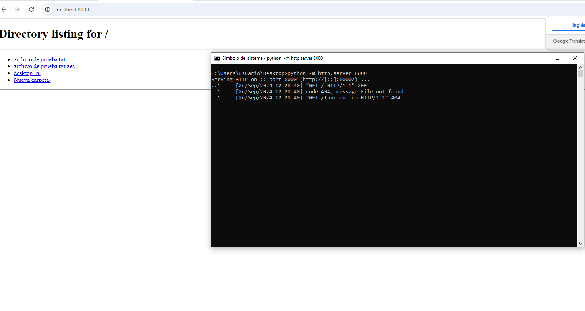

ejercicio 5
```python
python -m http.server 8000
```
esto es para hacer un servidor web

tan solo hay que poner una imagen de algo y cargar el servidor donde este la imagen tan solo hace falta que tu compañer@ ponga tu ip y el puerto que lle has asignado en el navegador y listo



pero si es tuyo propio tan solo poner localhost o 127.0.0.1 y el numero de puerto

